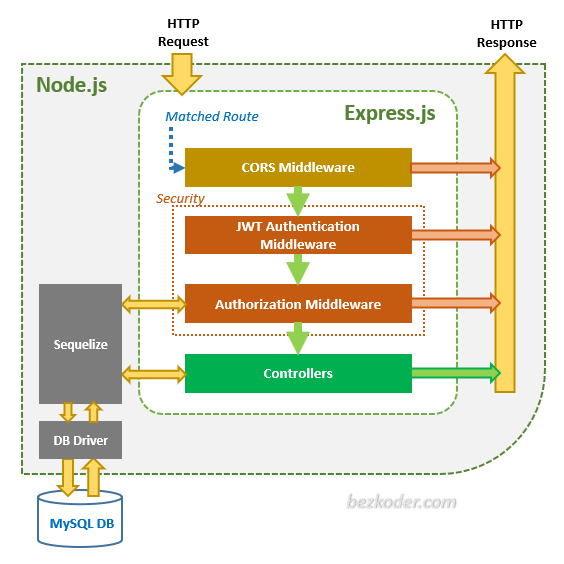

# Massino


Configure your health.


### Bootstrap

#### Nx
```
npm install -g nx
yarn create nx-workspace
```

#### Docker/Postgres
Init docker postgres db:
```shell
docker pull postgres:alpine
docker run --name massino-db -e POSTGRES_PASSWORD=mysecretpassword -d -p 5432:5432 postgres:alpine
```
Check that is running:
```
docker ps
```
Get into the container:
```
docker exec -it massino-db bash
```
Within the image, access postgres:
```
psql -U postgres
postgres-# \du # You are the superuser now
postgres-# create database massino; # Make sure to include the semi-colon
# check db
postgres=# \l
# connect to db
postgres=# \c massino
massino=# \d # Did not find any relations
```
Install `postgresql` on your local:
```
sudo dnf install postgres
```
From your machine, using psql, connect to the postgres running in the container:
```
psql -h localhost -p 5432 -U postgres
```
Copy the sql instructions to shape the db into your docker image:
```shell
docker cp ./db/migration.sql massino-db:/home/migration.sql
```
Enter into your container and run the following commands to create the tables from file:
```shell
# Enter the container
docker exec -it massino-db bash
# Create tables
psql massino postgres -f /home/migration.sql
```
Run db commands defined [here](db/migration.sql) to create tables.

### Serve the app
```shell
# BE
nx serve api
# FE
nx serve massino
```

### Express architecture  
Via `Express routes`, `HTTP request` that matches a `route` will be checked by `CORS Middleware` before coming to `Security layer`.  

`Security layer` includes:  

    `JWT Authentication Middleware`: verify SignUp, verify token
    `Authorization Middleware`: check User’s roles with record in database

If these middlewares throw any error, a message will be sent as `HTTP response`.

Controllers interact with Postgres Database via Sequelize and send `HTTP response` (`token`, user information, data based on roles…) to client.  
  